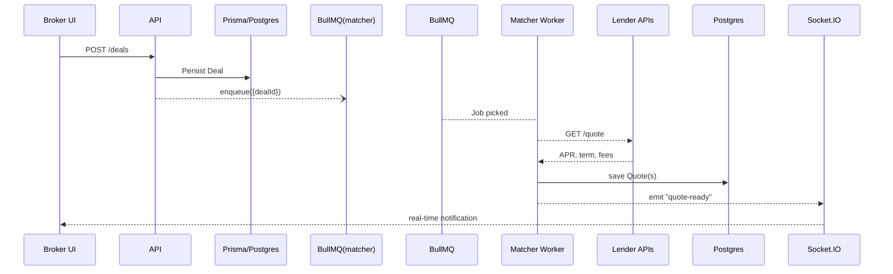

# turborepo monorepo with Next.js 15 + NestJS 11 + shadcn

This template is for creating a comprehensive Enterprise level app using Next.js 15 (frontend) and NestJS 11 (backend).
Use database of your choice (MySQL, PostgreSQL, etc.) and configure it in the app.

## Usage

You can use or follow the step 1 to clone.
```bash
pnpm dlx superepo@latest init
```

1. Clone the repository

```bash
git clone https://github.com/mohitarora/superepo.git

cd superepo
```

2. Setup Environment Variables

Copy .env.example to .env in both apps/api and apps/web
```bash
cp apps/api/.env.example apps/api/.env
cp apps/web/.env.example apps/web/.env
```

3. Install dependencies

```bash
pnpm install
```

4. Start the database (optional)

 for Postgres:
```bash
docker compose up -d
```
then update the .env file with the new password (default **DB_USERNAME**=postgres, **DB_DATABASE**=postgres) 

5. Start the app

```bash
pnpm dev
```

## 🏗️ Architecture Overview (Lender-Marketplace)

```
superepo/
├─ apps/
│  ├─ web/     ← Next.js 15 dashboard (Broker • Lender • Admin)
│  └─ api/     ← NestJS 11 HTTP + WebSocket API
├─ packages/
│  ├─ ui/      ← shared shadcn-based components
│  └─ shared/  ← TypeScript DTOs, validators, utils
└─ docker-compose.yml  ← Postgres • Redis • (future) minio
```

### 1. Frontend – **Next.js 15**

* **App Router** with role-based route groups (`/broker`, `/lender`, `/admin`)
* TailwindCSS + shadcn/ui; RSC + Server Actions call the API directly
* Auth handled by **NextAuth** (credentials provider) – stores JWT returned by the API
* Socket.IO client for real-time deal & chat updates

### 2. Backend – **NestJS 11**

| Layer             | Details                                                               |
| ----------------- | --------------------------------------------------------------------- |
| **HTTP & WS**     | REST controllers (`/deals`, `/quotes`), WebSocket gateway (`/chat`)   |
| **Prisma ORM**    | PostgreSQL models: `User`, `Deal`, `Quote`, `Message`, `Wallet`       |
| **Auth module**   | JWT (access + refresh) with optional TOTP (speakeasy)                 |
| **Queues**        | **BullMQ** on Redis – tasks: lender-matching, PDF export, email/Slack |
| **External APIs** | iwoca OpenLending, future Plaid/TrueLayer for open-banking            |
| **Docs**          | Swagger at `/api/docs` (auto-generated from decorators)               |

### 3. Infrastructure

* **Turborepo** – fast incremental builds; single `pnpm dev` spins up web + api
* **Docker Compose** – local Postgres 16 (`5432`) & Redis 7 (`6379`)
* **ENV management** – per-app `.env` files; secrets never committed
* **CI/CD** – GitHub Actions → Turbo cache → Vercel (web) & Fly.io / Render (api)

### 4. High-level Data Flow



### 5. Why This Design?

* **Single-repo DX:** shared types prevent contract drift; atomic PRs cover UI + API.
* **Prisma + Postgres:** strong relations, migrations, type-safe client.
* **BullMQ:** isolates CPU- or I/O-heavy tasks; keeps API responsive.
* **Socket.IO:** low-latency chat & status updates without polling.
* **Turborepo:** minimal config yet fast builds; Nx can be layered later if needed.

---

> Paste this section into your project’s **README.md** to give contributors (or future you) a concise mental map of how everything plugs together.
